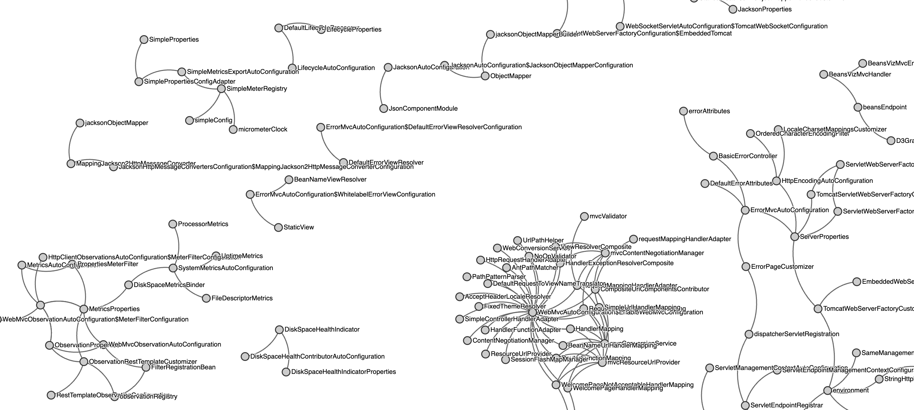

# Spring boot User Beans

[](https://github.com/jabrena/spring-boot-user-beans/actions/workflows/build.yaml)

[](https://sonarcloud.io/summary/new_code?id=jabrena_spring-boot-user-beans)

A visual way to help developers to increase awareness about minimize the number of Beans in memory.



## Requirements

- [x] Visualize Beans running in the container
- [x] List of user dependencies (Jars)
- [x] List of user dependencies (Jars) & packages
- [x] List of user beans
- [x] List of dependencies (Jars) & Beans
- [ ] Review quality of results
- [ ] Learn to disable beans not used

## Convention over configuration

Convention over configuration (also known as coding by convention) is a software design paradigm used by software frameworks that attempts to decrease the number of decisions that a developer using the framework is required to make without necessarily losing flexibility and don't repeat yourself (DRY) principles.

https://en.wikipedia.org/wiki/Convention_over_configuration

## How to run in local

```bash
mvn clean verify
mvn spring-boot:run -pl examples/hello-world/ -am
curl http://localhost:8080/graph1 | json_pp
curl http://localhost:8080/graph2 | json_pp
curl -v http://localhost:8080/actuator/userbeans/dependencies | json_pp
curl -v http://localhost:8080/actuator/userbeans/dependencies/packages | json_pp
curl -v http://localhost:8080/actuator/userbeans/dependencies/beans | json_pp
curl -v http://localhost:8080/actuator/userbeans/beans | json_pp
```

## Configuration

Enabling this spring boot property to enable this feature:

```
management.endpoints.web.exposure.include=beans
```

## Spring Boot CLI

```
sdk install springboot
spring init -d=web,devtools --build=maven --force ./
```

## References

- https://docs.spring.io/spring-framework/docs/current/javadoc-api/org/springframework/beans/factory/package-summary.html
- https://docs.spring.io/spring-framework/docs/current/javadoc-api/org/springframework/context/package-summary.html
- https://docs.spring.io/spring-boot/docs/current/maven-plugin/reference/htmlsingle/
- https://www.jetbrains.com/help/idea/spring-diagrams.html#spring-beans-diagram
- https://github.com/making/beansviz-spring-boot-actuator
- https://docs.spring.io/spring-boot/docs/current/reference/html/cli.html#cli.using-the-cli
- https://github.com/j3soon/directed-graph-visualization
- https://d3js.org/
- https://www.webjars.org/all