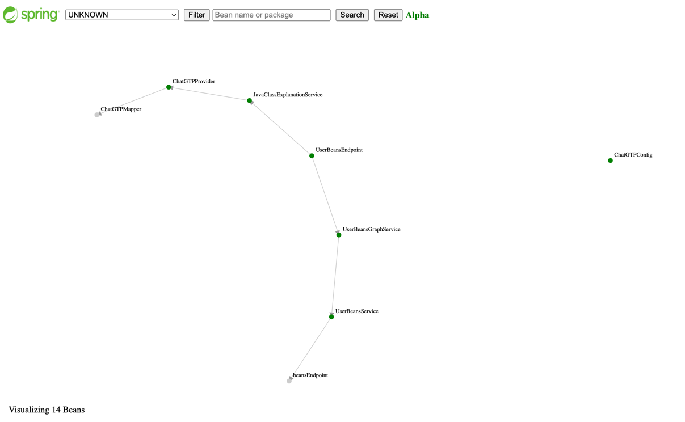
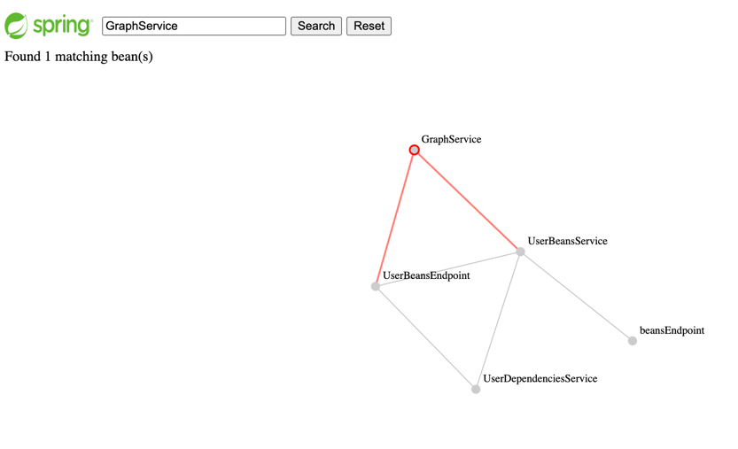
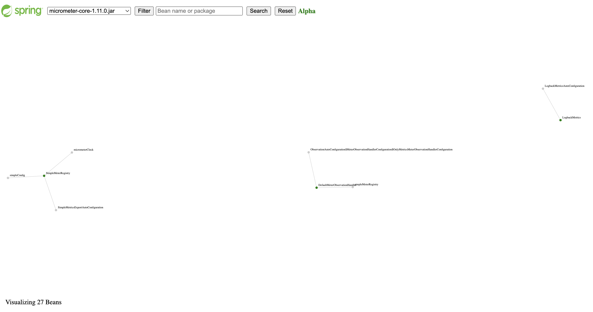
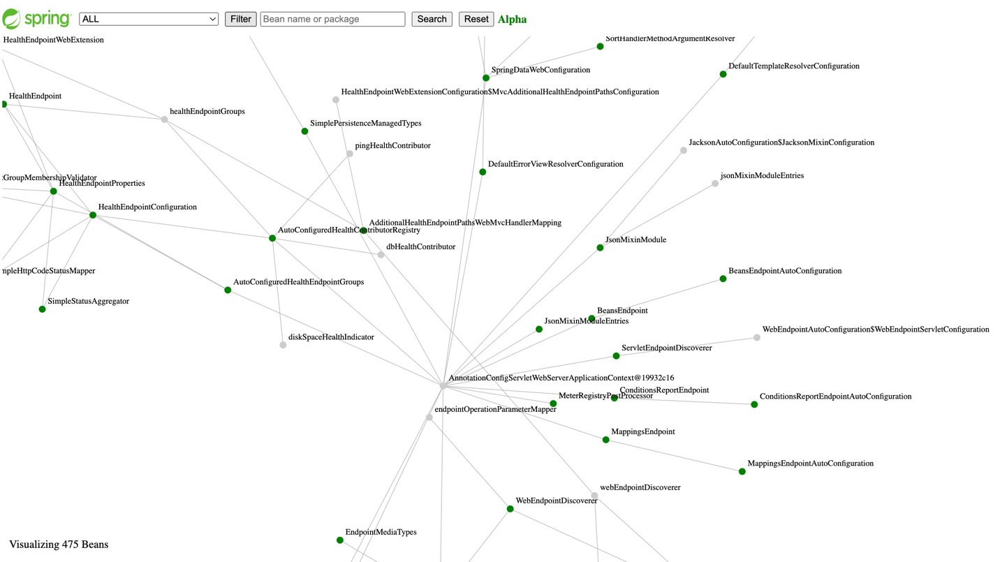

# Spring boot User Beans

[](https://github.com/jabrena/spring-boot-user-beans/actions/workflows/build.yaml)

[](https://sonarcloud.io/summary/new_code?id=jabrena_spring-boot-user-beans)

[](https://jitpack.io/#jabrena/spring-boot-user-beans)

A visual way to increase the developer awareness to minimize the number of Beans in memory.

The library exposes operational information about
your Spring Beans running in the memory as another
metric included with `Spring Boot Actuator`.

## Motivation

Using this project, you will be able to see your Beans developed in your project
plus other Beans provided by the dependencies that you include
in the **classpath** in a Graph representation. The project uses Graph theory to show the beans as a [Directed Graph](https://en.m.wikipedia.org/wiki/Directed_graph).

The user interfaces will allow you searching
your Beans by name or package and review the relations between them.
Also, you can filter by the main dependencies used in your Spring Boot project.



If you click in a any Green node (A Spring Bean which returns a Java class),
you could navigate to a Detail page, in order receive an explanation from ChatGPT.

## Getting Started

Add the following dependency in your build system:

**Maven:**

```xml
<repositories>
    <repository>
        <id>jitpack.io</id>
        <url>https://jitpack.io</url>
    </repository>
</repositories>
```

```xml
<dependency>
    <groupId>com.github.jabrena.spring-boot-user-beans</groupId>
    <artifactId>spring-boot-starter-user-beans</artifactId>
    <version>v0.2.0-SNAPSHOT</version>
</dependency>
```

**Gradle:**

```kotlin
allprojects {
    repositories {
        maven { url 'https://jitpack.io' }
    }
}
```

```gradle
dependencies {
    implementation 'com.github.jabrena.spring-boot-user-beans:spring-boot-starter-user-beans:v0.2.0-SNAPSHOT'
}
```

Further information: https://jitpack.io/#jabrena/spring-boot-user-beans/


**Note:** Coming soon on Maven Central with `JRELEASER`

### Configuration:

This library require a bit of configuration in the section about
`spring boot actuator`:

```properties
management.endpoints.web.exposure.include=beans,userbeans
```

The library has an optional feature to explain your Beans using the ChatGPT capabilities.
In order to use this feature, you need set a valid `OpenAI API Key`

**Example:**

```bash
export OPENAI_API_KEY=YOUR_API_KEY_VALUE
echo $OPENAI_API_KEY
./mvnw spring-boot:run -Dspring-boot.run.arguments="--userbeans.openapi.apikey=$OPENAI_API_KEY"
```

**Note:** If you don´t have a `OpenAI API Key`, you can use this library but the features from `ChatGPT`
will be disabled.

**Requirements:**

In order to use this Dependency, you need to have in the classpath:

- spring-boot-starter-web || spring-boot-starter-webflux
- spring-boot-starter-actuator

**Testing level:**

The project was tested with `Spring Boot 3.1.0`

## Benefits

### 1. Improve your Spring Beans composition

By leveraging the Graph representation,
you gain the ability to visualize all the Beans actively running
within your Spring Boot application. Additionally, you have
the flexibility to filter Beans based on their dependencies.
Analyzing the Graph Shape can reveal valuable insights about
the structure and relationships within your Spring solution,
enabling you to make informed decisions and discover intriguing patterns.



### 2. Be Stateful or not

By reviewing your Beans in a broader perspective,
you have the opportunity to evaluate whether your Objects
need to maintain state or can be stateless.
This examination allows you to make informed decisions about
the design and architecture of your application,
ensuring that the statefulness of your Beans aligns
with the requirements and objectives of your system.

### 3. Learn about how the different Spring Boot Starters were designed.

When you visit https://start.spring.io/, you gain access to a wide range
of Spring Boot Starters that can be incorporated into your project.
By exploring and utilizing this library, you have the opportunity
to delve into the design principles behind each Starter and
understand how they were specifically crafted to address various challenges.
This exploration enables you to gain valuable insights into
the decision-making process involved in designing these Starters,
fostering a deeper understanding of Spring Boot and
its versatile solutions.



### 4. Learn about the Beans that you are using under the hood.

When examining the Graph, you may notice the presence of numerous Beans
that are unfamiliar to you. These Beans form a critical part of
the underlying Infrastructure required to run your
Spring Boot application smoothly. By clicking on the Green nodes
within the Graph, you can access concise descriptions that
shed light on the purpose and functionality of each individual Bean.

### 5. Improve the way to measure the Cognitive Load in your team.

By leveraging this educational tool, you can enhance
your ability to measure and manage your
[Cognitive Load](https://en.wikipedia.org/wiki/Cognitive_load).
Cognitive Load refers to the mental effort required
for information processing.

## Goals

- [x] Visualize Beans running in the container
- [x] List of user beans
- [x] List of user dependencies (Jars)
- [x] Review quality of results
- [x] Filter by Java class, Package or dependency

## Convention over configuration

[Convention over configuration](https://en.wikipedia.org/wiki/Convention_over_configuration) (also known as coding by convention) is a software design paradigm used by software frameworks that attempts to decrease the number of decisions that a developer using the framework is required to make without necessarily losing flexibility and don't repeat yourself (DRY) principles.

## How to build and test in local

```bash
./mvnw clean verify
./mvnw clean verify -Ppipelines
./mvnw clean spring-boot:run \
  -pl examples/hello-world-servlet/ -am \
  -Dspring-boot.run.arguments="--userbeans.openapi.apikey=$OPENAI_API_KEY" \
  -Dmaven.repo.local=./local-m2

./mvnw spring-boot:run -pl examples/hello-world-reactive/ -am -Puserbeans -Dspring-boot.run.arguments="--userbeans.openapi.apikey=$OPENAI_API_KEY"
open http://localhost:8080/

#UX
curl -v http://localhost:8080/actuator/userbeans/graph | json_pp
curl -v http://localhost:8080/actuator/userbeans/graph | json_pp > ./docs/graph.json
curl -v http://localhost:8080/actuator/userbeans/graph-combo | json_pp
curl -v http://localhost:8080/actuator/userbeans/graph-combo | json_pp > ./docs/graph-combo.json
curl -v "http://localhost:8080/actuator/userbeans/graph?dependency=UNKNOWN" | json_pp
```

# External tests

The project was tested with the classic project **Spring PetClinic**.

```bash
./mvnw spring-boot:run -pl external-tests/spring-petclinic -am
```



Go for [external-tests](./external-tests/README.md) for further details.

## How to show the coverage on Codespaces?

```bash
# Step 1: Launch the webserver with the JACOCO Report
./mvnw clean verify
sdk install java 20-tem
sdk use java 20-tem
jwebserver -p 9000 -d "$(pwd)/coverage-module/target/site/jacoco-aggregate/"

# Step 2: Stop the webserver & use the default Java version
sdk env install
sdk env
```

## Limitations

**Graph Generation:**

Currently the D3.js graph is generated only using information from Edges
and it is possible to be improved.

Example: `curl -v "http://localhost:8080/actuator/userbeans/graph?dependency=micrometer-observation-1.11.0.jar" | json_pp`

```json
{
   "edges" : [
      {
         "source" : {
            "beanName" : "SimpleObservationRegistry",
            "beanPackage" : "io.micrometer.observation",
            "dependency" : "micrometer-observation-1.11.0.jar"
         },
         "target" : {
            "beanName" : "ObservationAutoConfiguration",
            "beanPackage" : "UNKNOWN",
            "dependency" : "UNKNOWN"
         }
      }
   ],
   "nodes" : []
}
```

This data structure need to be evolved a better way:

```js
var nodes = [
    {name: 'A'},
    {name: 'B'},
    {name: 'C'},
    {name: 'D'},
    {name: 'E'},
    {name: 'F'},
    {name: 'G'},
    {name: 'H'},
]

var links = [
    {source: 0, target: 1},
    {source: 0, target: 2},
    {source: 0, target: 3},
    {source: 1, target: 6},
    {source: 3, target: 4},
    {source: 3, target: 7},
    {source: 4, target: 5},
    {source: 4, target: 7}
]
```

https://codepen.io/jabrena/pen/zYMWpJw

Related issues:

- https://github.com/jabrena/spring-boot-user-beans/issues/111
- https://github.com/jabrena/spring-boot-user-beans/issues/85

**Current limitation to get Class from deps:**

The Bean `BeansEndpoint` provides a way to retrieve
all Beans and dependencies, but some dependencies are not easy
to retrieve the class. I believe that I need to learn more about
`Proxy Beans`.

## Other commands

```
./mvnw prettier:write
./mvnw versions:display-dependency-updates
./mvnw versions:display-plugin-updates
./mvnw versions:set -DnewVersion=0.3.0-SNAPSHOT
./mvnw versions:commit -DprocessAllModules
```

## Source of inspiration

- https://github.com/making/beansviz-spring-boot-actuator
- https://github.com/spring-projects/spring-framework/issues/29973

## References

- https://en.m.wikipedia.org/wiki/Directed_graph
- https://docs.spring.io/spring-framework/docs/current/javadoc-api/org/springframework/beans/factory/package-summary.html
- https://docs.spring.io/spring-framework/docs/current/javadoc-api/org/springframework/context/package-summary.html
- https://docs.spring.io/spring-boot/docs/current/api/org/springframework/boot/actuate/beans/BeansEndpoint.html
- https://github.com/spring-projects-experimental/spring-boot-thin-launcher
- https://docs.spring.io/spring-boot/docs/current/reference/html/cli.html#cli.using-the-cli
- https://jakarta.ee/specifications/cdi/3.0/
- https://jakarta.ee/specifications/cdi/3.0/jakarta-cdi-spec-3.0.pdf
- https://d3js.org/
- https://www.webjars.org/all
- https://www.eclemma.org/jacoco/trunk/doc/maven.html
- https://platform.openai.com/docs/api-reference/
- https://platform.openai.com/account/usage
- https://platform.openai.com/account/api-keys
- https://openai.com/pricing
- https://jitpack.io/#jabrena/spring-boot-user-beans/

Made with ❤️ from Madrid
