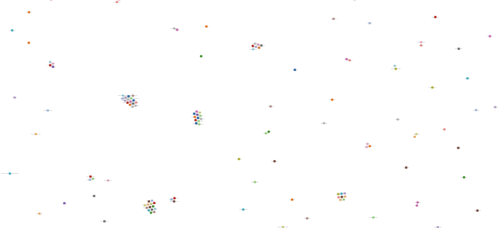

# Spring boot User Beans

[](https://github.com/jabrena/spring-boot-user-beans/actions/workflows/build.yaml)

A project to learn about the Beans that you maintain in memory when you run your projects.



## Requirements

- [ ] Offer a tool to be used to understand better the beans that you use in your application.
- [ ] Generate an inventory with the following relationship: 
    - 1 Maven dependency : n Beans in memory
- [ ] Understand better the Spring Bean container

## Convention over configuration

Convention over configuration (also known as coding by convention) is a software design paradigm used by software frameworks that attempts to decrease the number of decisions that a developer using the framework is required to make without necessarily losing flexibility and don't repeat yourself (DRY) principles.

https://en.wikipedia.org/wiki/Convention_over_configuration

## How to run in local

```
mvn spring-boot:run -pl examples/hello-world/ -am
curl http://localhost:8080/beansviz
http://localhost:8080
```

## Configuration

Enabling this spring boot property to enable this feature:

```
management.endpoints.web.exposure.include=beans
```

## Spring Boot CLI

```
sdk install springboot
spring init -d=web,devtools --build=maven --force ./
```

## References

- https://docs.spring.io/spring-framework/docs/current/javadoc-api/org/springframework/beans/factory/package-summary.html
- https://docs.spring.io/spring-framework/docs/current/javadoc-api/org/springframework/context/package-summary.html
- https://docs.spring.io/spring-boot/docs/current/maven-plugin/reference/htmlsingle/
- https://www.jetbrains.com/help/idea/spring-diagrams.html#spring-beans-diagram
- https://github.com/making/beansviz-spring-boot-actuator
- https://docs.spring.io/spring-boot/docs/current/reference/html/cli.html#cli.using-the-cli
- https://github.com/j3soon/directed-graph-visualization
- https://d3js.org/
- https://www.webjars.org/all