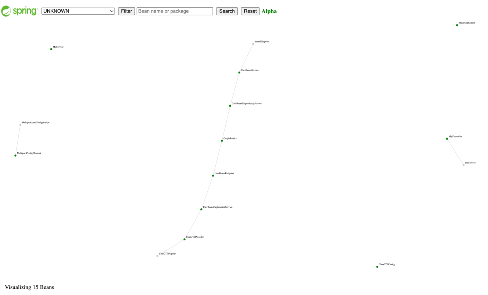

# Spring boot User Beans

[](https://github.com/jabrena/spring-boot-user-beans/actions/workflows/build.yaml)

[](https://sonarcloud.io/summary/new_code?id=jabrena_spring-boot-user-beans)

A visual way to increase the developer awareness to minimize the number of Beans in memory.

## Motivation

Using this project, you will be able to see your Beans developed in your project
plus other Beans provided by the dependencies that you include
in the **classpath**. The project uses Graph theory to show the beans as a [Directed Graph](https://en.m.wikipedia.org/wiki/Directed_graph).

Using a minimalistic User interface, you will be able to search
your Beans by name or package and review the relations between them.
Also, you can filter by the main dependencies used in your Spring Boot project.



If you click in a any Green node (A Spring Bean which returns a Java class),
you could navigate to a Detail page, in order receive an explanation from ChatGTP.

**Note:** in order to enable that feature, you need to set in your
environment a valid OPENAI_API_KEY.

```bash
export OPENAI_API_KEY=YOUR_API_KEY_VALUE
echo $OPENAI_API_KEY
```

## Use cases

### 1. Review the Bean composition in your projects

Reviewing the Beans relations, you could see new opportunities
to improve the Design of your solution.


Using the Graph, you could see all Beans running in your Spring Boot application
or filter by a dependency. If you see the Graph Shape, you could discover
interesting insights.

### 2. Learn more about the Beans that you are using under the hood.

If you observe the Graph, you could see that exist plenty of Beans that you
don´t know but it is part of the Infrastructure to run your Spring Boot
application. If you click in the Green nodes, you could ask Chat GTP to
explain that Spring Bean.

### 3. Improve the way to calculate the Cognitive Load.

Using this educational tool, you could improve the way that you measure
your [**Cognitive Load**](https://en.wikipedia.org/wiki/Cognitive_load).

## Goals

- [x] Visualize Beans running in the container
- [x] List of user beans
- [x] List of user dependencies (Jars)
- [x] Review quality of results
- [x] Filter by Java class, Package or dependency
- [ ] Learn to disable beans not used

## Convention over configuration

Convention over configuration (also known as coding by convention) is a software design paradigm used by software frameworks that attempts to decrease the number of decisions that a developer using the framework is required to make without necessarily losing flexibility and don't repeat yourself (DRY) principles.

https://en.wikipedia.org/wiki/Convention_over_configuration

## How to run in local

```bash
./mvnw clean verify
./mvnw clean verify -Ppipelines
./mvnw spring-boot:run -pl examples/hello-world-servlet/ -am
./mvnw spring-boot:run -pl examples/hello-world-reactive/ -am -Puserbeans
open http://localhost:8080/

#UX
curl -v http://localhost:8080/actuator/userbeans/graph | json_pp
curl -v http://localhost:8080/actuator/userbeans/graph | json_pp > ./docs/graph.json
curl -v http://localhost:8080/actuator/userbeans/graph-combo | json_pp
curl -v http://localhost:8080/actuator/userbeans/graph-combo | json_pp > ./docs/graph-combo.json
curl -v "http://localhost:8080/actuator/userbeans/graph?dependency=UNKNOWN" | json_pp
```

# External tests

The project was tested with the classic project **Spring PetClinic**.

```
./mvnw spring-boot:run -pl external-tests/spring-petclinic -am
```


Go for [external-tests](./external-tests/README.md) for details.

## Configuration

Enabling this spring boot property to enable this feature:

```
management.endpoints.web.exposure.include=beans,userbeans
```

## How to show the coverage on Codespaces?

```bash
# Step 1: Launch the webserver with the JACOCO Report
./mvnw clean verify
sdk install java 20-tem
sdk use java 20-tem
jwebserver -p 9000 -d "$(pwd)/coverage-module/target/site/jacoco-aggregate/"

# Step 2: Stop the webserver & use the default Java version
sdk env install
sdk env
```

## Other commands

```
./mvnw prettier:write
./mvnw versions:display-dependency-updates
./mvnw versions:display-plugin-updates
```

## Source of inspiration

- https://github.com/making/beansviz-spring-boot-actuator
- https://github.com/spring-projects/spring-framework/issues/29973

## References

- https://en.m.wikipedia.org/wiki/Directed_graph
- https://docs.spring.io/spring-framework/docs/current/javadoc-api/org/springframework/beans/factory/package-summary.html
- https://docs.spring.io/spring-framework/docs/current/javadoc-api/org/springframework/context/package-summary.html
- https://docs.spring.io/spring-boot/docs/current/api/org/springframework/boot/actuate/beans/BeansEndpoint.html
- https://docs.spring.io/spring-boot/docs/current/reference/html/cli.html#cli.using-the-cli
- https://d3js.org/
- https://www.webjars.org/all
- https://www.eclemma.org/jacoco/trunk/doc/maven.html
- https://platform.openai.com/account/usage
- https://platform.openai.com/account/api-keys
- https://openai.com/pricing

Made with ❤️ from Madrid
